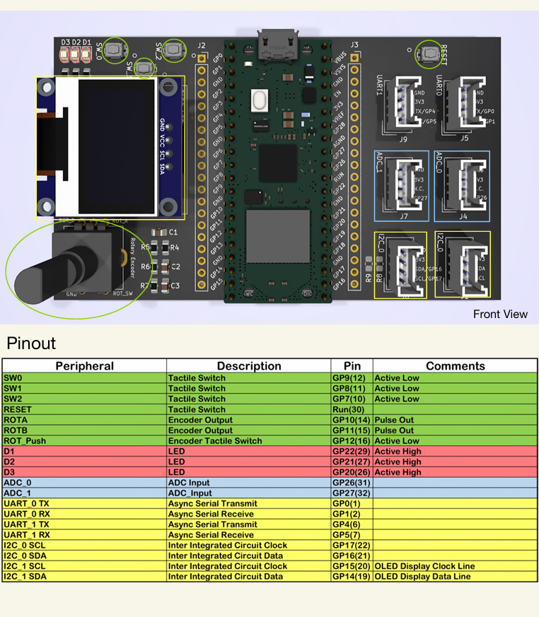

# Projekti - Ryhmä 3
## Micropython muistiinpanoja
### Tarvittavat importit

    from machine import UART, Pin, I2C, Timer, ADC, PWM
    from ssd1306 import SSD1306_I2C
    from fifo import Fifo
    import time

## Raspin IO

### Tactile switches
sw2 = Pin(7, Pin.IN, Pin.PULL_UP)    
sw1 = Pin(8, Pin.IN, Pin.PULL_UP)    
sw0 = Pin(9, Pin.IN, Pin.PULL_UP)      
Nappulan arvon voi lukea näin:      
if sw2.value()==0:                       

### LED

    d1 = Pin(22, Pin.OUT)
    d2 = Pin(21, Pin.OUT)
    d3 = Pin(20, Pin.OUT)

LED päälle (1) ja pois (0)

        d1.value(1)
        d1.value(0)

### PWM luokan LEDit                                                
PWM luokalla voi säätää LEDien kirkkautta välillä 0-65536       
                                                                 
PWM LEDit pitää määritellä näin:  

    d1 = PWM(Pin(22), freq = 1000, duty_u16 = 0)            
    d2 = PWM(Pin(21), freq = 1000, duty_u16 = 0)           
    d3 = PWM(Pin(20), freq = 1000, duty_u16 = 0)            
                                                        
PWM kirkkauden asettaminen:                         

    d1.duty_u16(1000) #asettaa kohtalaisen kirkkauden   
    d2.duty_u16(0) #sammuttaa LEDin

### I2C pinni näyttöä varten  

    i2c = I2C(1, scl=Pin(15), sda=Pin(14), freq=400000)

 

### Rotary encoder vaatii hardware interruptin Pin.irq - metodin kautta:
Määritellään pinnit:  
    
    rot_push = Pin(12, Pin.IN, Pin.PULL_UP)                 
    rota = Pin(10, Pin.IN, Pin.PULL_UP) #clock signal      
    rotb = Pin(11, Pin.IN, Pin.PULL_UP) #rot value    

Tehdään Encoder luokka jolla on handler-metodi ja pinni-a.irq -attribuutti:

    class Encoder:
        def __init__(self, rota, rotb):
            self.a = rota
            self.b = rotb
            self.fifo = Fifo(30, typecode = 'i')
            self.a.irq(handler = self.handler, trigger = Pin.IRQ_RISING, hard = True)
    

        def handler(self, pin):
            print("handler called")
            if self.b():
                self.fifo.put(-1)
            else:
                self.fifo.put(1)

encoder1 määritellään Encoder luokkaan:

    encoder1 = Encoder(rota, rotb)

encoder1 arvo luetaan tämän jälkeen näin:

    encoder1_input =0
    if encoder1.fifo.has_data():
        encoder1_input = encoder1.fifo.get()
        print(encoder1_input)